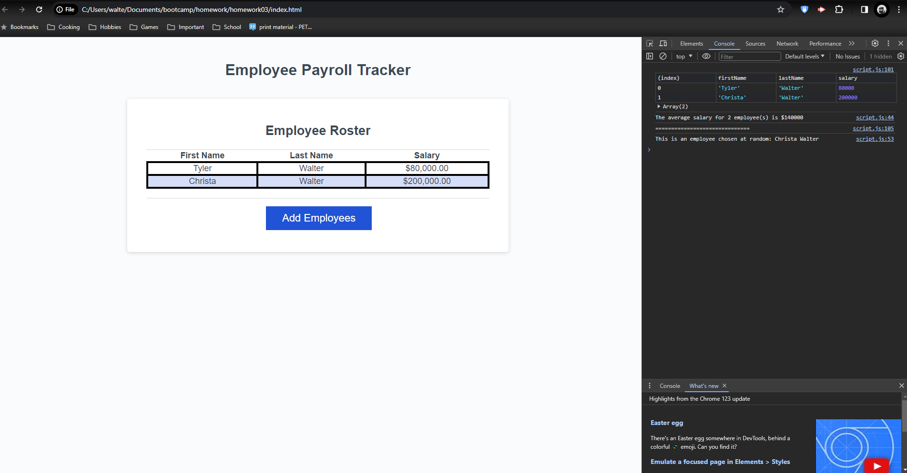

# Employee Data
This is a homework assignment where I had some starter code and I needed to update it with some functions to make it work.

## Description
This is a quick and dirty way to add employees names and their salary to an array and use that information to find the average salary as well as choosing to view an employee at random.

[Here is the link](https://tywalter.github.io/employee-data/) to the deployed website.

## Visuals 
*  of the deployed website

## Usage
This is intended for adding employees and their salaries to a table and for grading purposes.

## Support
If you have any issues with this repo, shoot me an email at walterty89@gmail.com.

